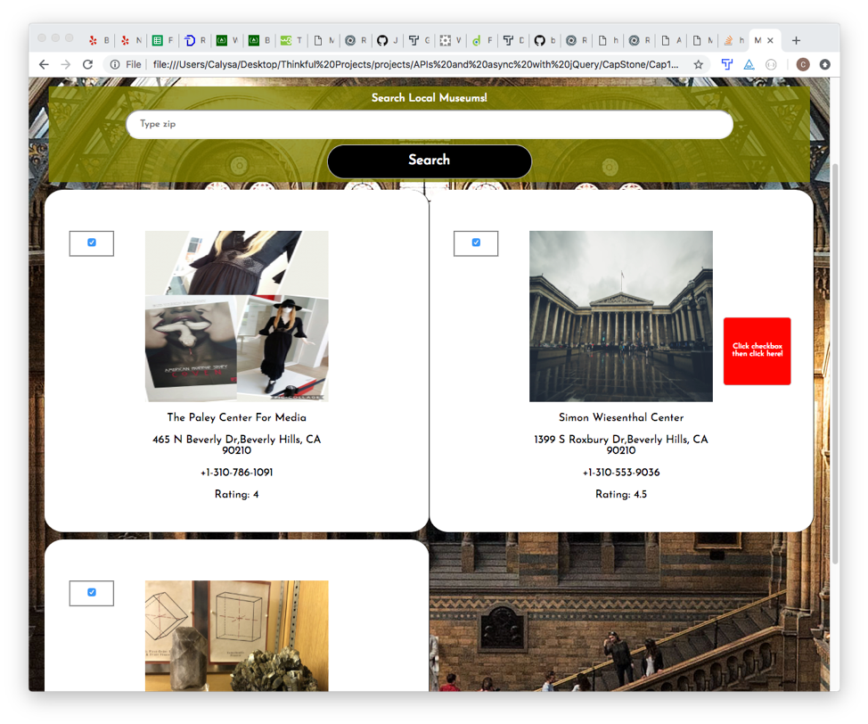

# Cap1Muse - The "Muse" App
With the ‘Muse’ app just enter your zip code and search for the closest museum in your area. It’s a fun and easy way to find a creative space for yourself, friends, and/or family to explore. The App uses the Yelp API to link results to Yelp site for further information and insight about the museums before you go!
# Live Link to App
https://calysabean.github.io/Cap1Muse/
# Motivation
I wanted to create an app that made it easy for creatives to find local musuems. When visiting a city or when in your own city it can be difficult to find a creative space, so the "Muse" app makes it easy to locate/select museums, and then render a personalized list of your results.
# Screenshots
Landing Page:

Initial Search Page:

Initial Results Page:

Personalized Results Page:

# Built With:
* HTML
* CSS
* JavaScript/jQuery
